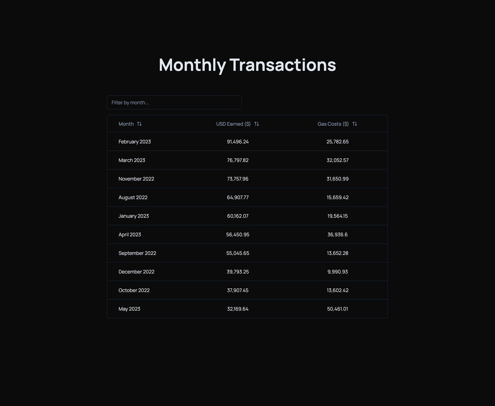

# Create T3 App Table

### [Click to view the website](https://t3-table.vercel.app/)

### Building the App

- This is a [T3 Stack](https://create.t3.gg/) project bootstrapped with `create-t3-app`.
- I used Planetscale and seeded some data into a table
- Some of the components are from [shadcnui](https://ui.shadcn.com/docs/components/accordion)
- The table was built using [TanStack React Table](https://tanstack.com/table/v8) and [shadcnui](https://ui.shadcn.com/docs/components/accordion)

